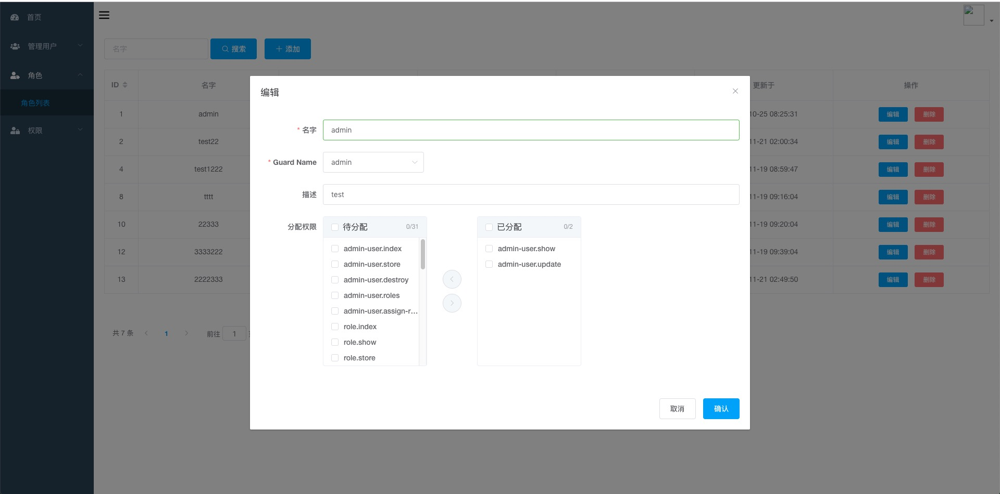

# 🥑Avocado
## Single Page Laravel admin panel based on vuejs 




### Install 

`composer require shawnrong/avocado`

`php artisan avocado:install`

`php artisan migrate`

`php artisan db:seed --class="ShawnRong\Avocado\Database\AvocadoTableSeeder"`


edit `.env` file, add config:
`API_PREFIX="api"`

update config/auth.php

``` php
'guards' => [
    'api' => [
        'driver' => 'jwt',
        'provider' => 'admin',
    ]
]
'providers' => [
    'admin' => [
        'driver' => 'eloquent',
        'model' => ShawnRong\Avocado\Models\AdminUser::class,
    ]
]
```

Add avocado.js to webpack.mix.js

``` javascript
mix.js('resources/js/app.js', 'public/js')
   .sass('resources/sass/app.scss', 'public/css')
   .js('resources/js/avocaodo/avocado.js', 'public/js');
```
